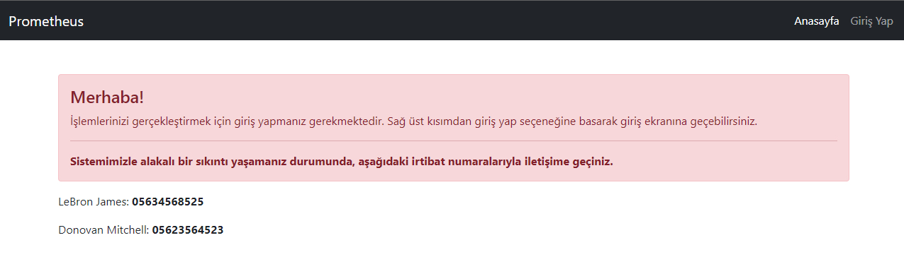
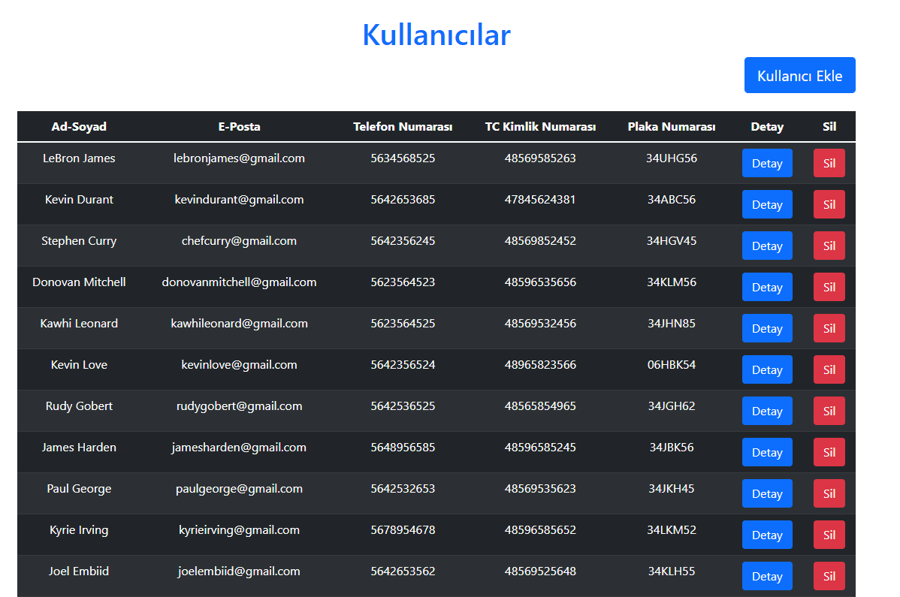

# Patika - Gelecek Varlik Bitirme Projesi

<!-- 

    

 -->

- Frontend tarafında React teknolojisi kullanılmıştır.
- Toplam 17 farklı sayfa bulunmaktadır.
- Başlangıçta anasayfa gözükmekte ve burada kullanıcının giriş yapıp yapmadığı kontrol edilmektedir.
- Giriş yapmamış bir kullanıcı menüden işlemlerine erişemez, bu sebepten dolayı sıkıntı yaşaması durumda etkileşime geçebileceği irtibat numaralarını görmektedir.

- Giriş yapıldıktan sonra kullanıcı admin değilse kendisi hakkındaki sayfalar hariç hiçbir sayfaya erişemez.

- Kullanıcı adminse çeşitli sayfalara erişim hakkı vardır.

- Normal kullanıcı mesajlarına, fatura veya aidat bilgilerine, kendi profil bilgilerine erişebilmektedir.

- Admin ise kullanıcılara fatura ya da aidat atayabiliyor, kullanıcıları listeleyebiliyor, düzenleyebiliyor, silebiliyor, alacakları görebiliyor, konutları listeleyebiliyor, silebiliyor, konutlara kullanıcı ekleyebiliyor.

## Fatura Eklemeye Geçmek İçin Gerekli Sayfa

## Fatura Ekleme Sayfası

## Kullanıcıların Listelendiği Sayfa

- Fatura ödeme işlemi, kullanıcı fatura bilgilerine girdiğinde yapılabiliyor.

## Fatura Ödeme

- Eğer kullanıcının sistemde kayıtlı kredi kartı yoksa ödeme yerine sisteme kredi kartı bilgisinin girilmesi isteniyor ve kredi kartı MongoDB'ye ekleniyor; sistemde kayıtlı kredi bulunuyor ise ödemeyi doğrudan gerçekleştirebiliyor.

## Kredi Kartı Yoksa

- Backend tarafında .Net Core teknolojisi kullanılmıştır.
- Api, service, model, db olarak toplam 4 katmanı bulunuyor.
- Kredi kartı için MongoDB, diğer tüm alanlar için ise MsSql kullanılmıştır.
- Kullanıcı oturumunun yönetilmesi için session ve jwt token kullanılmıştır.
- Kullanıcının token'ına bakılarak giriş yapmış olup olmadığı kontrol edilmekte ve ona göre menüdeki erişimi kısıtlanmaktadır.

## License
[MIT](https://www.mit.edu/)
